# adbs_datepicker

A reusable Flutter date picker for **Bikram Sambat (BS)** and **Gregorian (AD)** dates.

`adbs_datepicker` lets users select dates from either the BS or AD calendar and returns **both calendar values** together. It also supports Nepali numerals, Nepali month and weekday names, public holidays, events, date ranges, time selection, customizable trigger styles, and month/year navigation.

---

## Screenshots

The picker provides a complete BS and AD calendar experience with a switch between both calendar systems.

### BS Calendar

The BS calendar displays Nepali month names, Nepali numerals, weekdays, holidays, events, and the corresponding AD day.

<p align="center">
  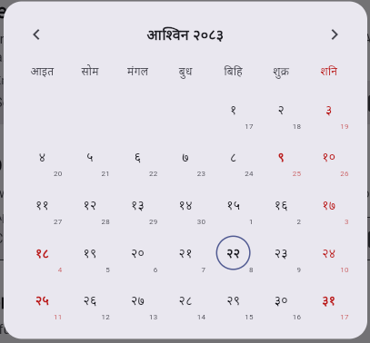
</p>

### AD Calendar

The AD calendar provides the familiar Gregorian calendar while still allowing the user to switch back to BS at any time.

<p align="center">
  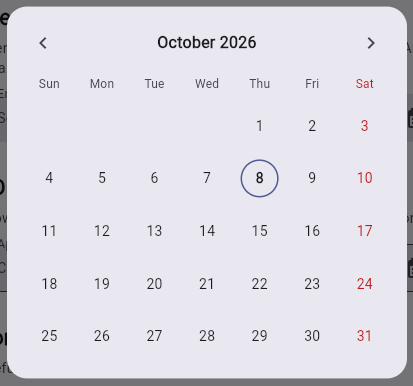
</p>

### BS and AD Calendar

The same picker can switch between BS and AD without opening a separate component.

<table>
  <tr>
    <td align="center">
      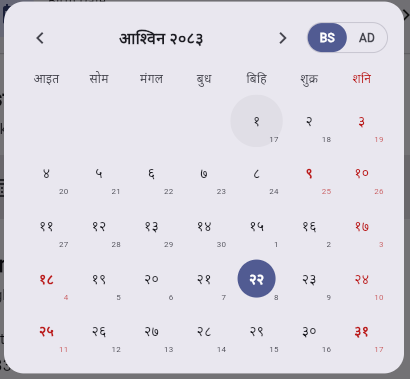
      <br>
      <b>BS Calendar</b>
    </td>
    <td align="center">
      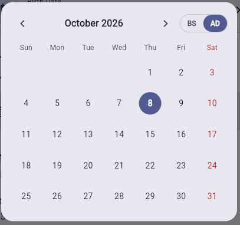
      <br>
      <b>AD Calendar</b>
    </td>
  </tr>
</table>

---

## Features

- **BS and AD calendars in one picker**
- **Switch between BS and AD** inside the same dialog
- **Both dates returned** from every selection
- BS dates returned in `YYYY-MM-DD` format
- AD dates returned in `YYYY-MM-DD` format
- **Nepali month names**
- **Nepali weekday names**
- **Nepali numerals** on the BS calendar
- **Public holidays and events**
- Long-press a day to view its events
- Matching AD day displayed inside BS calendar cells
- **Date range selection**
- Minimum and maximum selectable date limits
- **12-hour and 24-hour time selection**
- Month picker
- Year picker
- Separate BS and AD month/year navigation
- Seven built-in trigger styles
- Fully custom trigger support
- Custom accent color
- In-memory BS month caching
- Injectable HTTP services
- Custom API base URL support
- Testable with a custom HTTP client
- Material 3 compatible

---

# Installation

## From pub.dev

Add the package to your `pubspec.yaml`:

```yaml
dependencies:
  adbs_datepicker: ^1.0.0
```

Then run:

```bash
flutter pub get
```

## From GitHub

You can also use the package directly from GitHub:

```yaml
dependencies:
  adbs_datepicker:
    git:
      url: https://github.com/your-username/adbs_datepicker.git
      ref: v1.0.0
```

Then:

```bash
flutter pub get
```

> Replace `your-username` with the GitHub account or organization that owns the repository.

---

## Requirements

| Requirement | Minimum |
| ----------- | ------: |
| Flutter     |    3.27 |
| Dart        |     3.0 |

---

# Platform Setup

The package uses an online API for BS calendar data and AD → BS conversion.

Therefore, the application needs internet access.

## Android

Add the following permission to:

```text
android/app/src/main/AndroidManifest.xml
```

```xml
<uses-permission android:name="android.permission.INTERNET" />
```

## macOS

Add the following to both:

```text
DebugProfile.entitlements
Release.entitlements
```

```xml
<key>com.apple.security.network.client</key>
<true/>
```

## iOS, Web, Windows and Linux

No additional configuration is required.

For web applications, the API server must allow CORS requests from your application's origin.

---

# Quick Start

Import the package:

```dart
import 'package:adbs_datepicker/adbs_datepicker.dart';
import 'package:flutter/material.dart';
```

Then use:

```dart
NepaliDatePicker(
  label: 'Date of Birth',
  onChanged: (NepaliDateValue value) {
    print(value.bsDate);
    print(value.adDate);
  },
)
```

Example output:

```text
BS: 2083-06-14
AD: 2026-10-01
```

---

# Complete Example

The following example demonstrates several of the available options:

```dart
NepaliDatePicker(
  label: 'Appointment',
  hint: 'Choose a date',
  displayFormat: NepaliDateDisplayFormat.bsWithAd,
  style: NepaliDatePickerStyle.filled,
  themeColor: Colors.teal,
  initialBsDate: '2083-06-14',
  firstAdDate: DateTime(2026, 1, 1),
  lastAdDate: DateTime(2027, 12, 31),
  enableTime: true,
  timeFormat: '12',
  showModeToggle: true,
  showSecondaryDay: true,
  onChanged: (value) {
    debugPrint(value.toString());
  },
)
```

---

# Calendar Modes

The picker supports two calendar systems:

- **Bikram Sambat (BS)**
- **Gregorian (AD)**

The user can switch between them using the BS / AD toggle inside the picker.

### BS Mode

The BS calendar uses:

- Nepali month names
- Nepali numerals
- Nepali weekday names
- Matching AD day
- Nepali events and holidays

### AD Mode

The AD calendar uses:

- Gregorian month names
- English weekday names
- Gregorian date numbers
- BS conversion when a date is selected

---

# Display Formats

`displayFormat` controls the value displayed in the trigger and determines which calendar opens initially.

| Format                             | Field text                | Opens on |
| ---------------------------------- | ------------------------- | -------- |
| `NepaliDateDisplayFormat.bs`       | `2083-06-14`              | BS       |
| `NepaliDateDisplayFormat.bsWithAd` | `2083-06-14 (2026-10-01)` | BS       |
| `NepaliDateDisplayFormat.ad`       | `2026-10-01`              | AD       |
| `NepaliDateDisplayFormat.adWithBs` | `2026-10-01 (2083-06-14)` | AD       |

Example:

```dart
NepaliDatePicker(
  displayFormat: NepaliDateDisplayFormat.bsWithAd,
  onChanged: (value) {},
)
```

You can also use:

```dart
displayFormat.calendarMode
```

to determine which calendar the format opens on.

---

# Month and Year Selection

The picker provides dedicated month and year selection screens.

## BS Month Picker

<p align="center">
  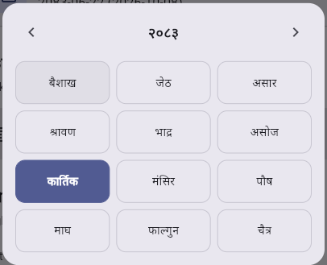
</p>

Users can tap the month title to open the BS month selection interface.

## AD Month Picker

<p align="center">
  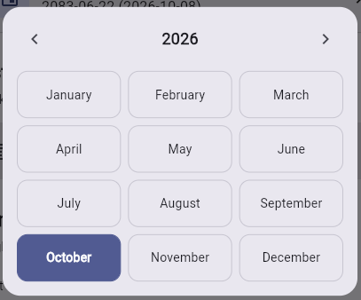
</p>

The same interaction is available for the AD calendar.

## BS Year Picker

<p align="center">
  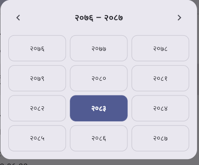
</p>

## AD Year Picker

<p align="center">
  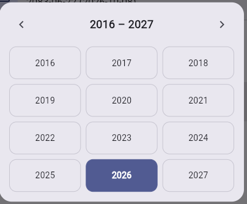
</p>

### Navigation

The picker supports:

- Previous month
- Next month
- Previous year range
- Next year range
- Month selection
- Year selection

The calendar automatically refreshes when navigating between months and years.

---

# Holidays and Events

Public holidays and calendar events are displayed directly inside the calendar.

<p align="center">
  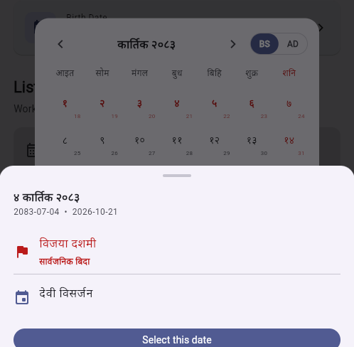
</p>

National holidays are highlighted in red.

When a day contains events, the user can **long-press the day** to open the event sheet.

The event sheet provides:

- Event name
- Event description
- Holiday information
- Selected date
- A **Select this date** action

The displayed event language follows the active calendar mode.

### BS Mode

Nepali event names are displayed.

### AD Mode

English event names are displayed.

---

# Date Range Selection

The picker can be configured to select a start and end date.

```dart
NepaliDatePicker(
  enableRange: true,
  themeColor: Colors.teal,
  onChanged: (value) {
    debugPrint(value.toString());
  },
)
```

Example:

<p align="center">
  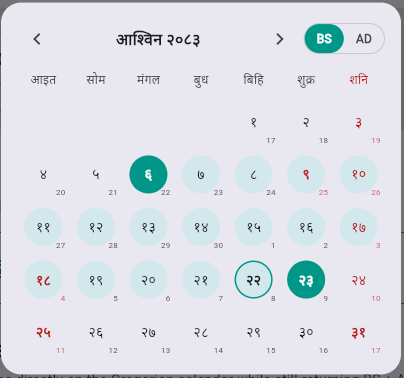
</p>

Range selection uses the same calendar interface and theme color.

The selected range uses:

- Full accent color for the endpoints
- A lighter/translucent version of the accent color for dates inside the range

---

# Date Limits

You can restrict the selectable dates using AD dates.

```dart
NepaliDatePicker(
  firstAdDate: DateTime(2026, 1, 1),
  lastAdDate: DateTime(2027, 12, 31),
  onChanged: (value) {},
)
```

The limits are always expressed in **AD**.

They are automatically applied to both calendars.

For example, if:

```dart
firstAdDate: DateTime(2026, 1, 1)
```

is provided, any BS date whose corresponding AD date is before January 1, 2026 will be disabled.

---

# Time Selection

The picker optionally supports time selection.

```dart
NepaliDatePicker(
  enableTime: true,
  timeFormat: '12',
  onChanged: (value) {
    print(value.time);
  },
)
```

Example:

<p align="center">
  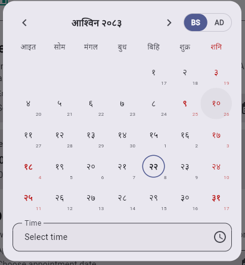
</p>

The time picker uses Flutter's standard time picker interface.

## 12-Hour Format

```dart
NepaliDatePicker(
  enableTime: true,
  timeFormat: '12',
  onChanged: (value) {
    print(value.time);
  },
)
```

Example value:

```text
10:30 AM
```

## 24-Hour Format

```dart
NepaliDatePicker(
  enableTime: true,
  timeFormat: '24',
  onChanged: (value) {
    print(value.time);
  },
)
```

Example value:

```text
22:30
```

<p align="center">
  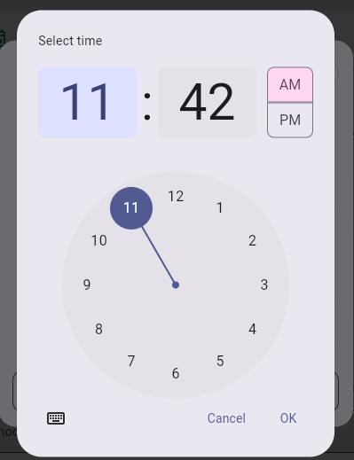
</p>

The selected time is returned through:

```dart
NepaliDateValue.time
```

---

# Trigger Styles

The picker supports multiple built-in trigger styles.

```dart
NepaliDatePicker(
  style: NepaliDatePickerStyle.card,
  onChanged: (_) {},
)
```

Available styles:

| Style      | Description                                                  |
| ---------- | ------------------------------------------------------------ |
| `standard` | Outlined text field with a calendar icon                     |
| `filled`   | Filled text field with no border                             |
| `outlined` | Bordered box with icon on the left and label above the value |
| `compact`  | Rounded pill sized to its content                            |
| `card`     | Elevated card with icon badge and chevron                    |
| `listTile` | Tinted `ListTile`                                            |
| `minimal`  | Plain label and value with no border                         |

The default style is:

```dart
NepaliDatePickerStyle.standard
```

You can also provide a custom icon:

```dart
NepaliDatePicker(
  icon: Icons.event,
  onChanged: (_) {},
)
```

---

# Custom Trigger

For complete control over the trigger UI, use `triggerBuilder`.

```dart
NepaliDatePicker(
  onChanged: (value) {
    setState(() {
      _value = value;
    });
  },
  triggerBuilder: (
    context,
    displayText,
    open,
  ) {
    return ElevatedButton.icon(
      onPressed: open,
      icon: const Icon(Icons.event),
      label: Text(
        displayText ?? 'Pick a date',
      ),
    );
  },
)
```

The builder receives:

- `context`
- Current display text
- `open` callback

When `triggerBuilder` is provided, it takes precedence over the built-in `style`.

---

# Picker Color

Use `themeColor` to customize the appearance of the picker.

```dart
NepaliDatePicker(
  themeColor: Colors.teal,
  onChanged: (value) {},
)
```

The color is applied to:

- BS / AD switch
- Selected dates
- Today's date ring
- Month selection
- Year selection
- Trigger accents
- Time picker accents
- Date range endpoints

For range selection, dates between the endpoints use a lighter shade of the selected color.

If `themeColor` is not provided, the picker uses:

```dart
Theme.of(context).colorScheme.primary
```

A custom `triggerBuilder` remains completely under your control.

---

# Configuration Options

| Parameter          | Type                            | Default         | Description                            |
| ------------------ | ------------------------------- | --------------- | -------------------------------------- |
| `onChanged`        | `ValueChanged<NepaliDateValue>` | **required**    | Called when a date or time is selected |
| `label`            | `String`                        | `'Date'`        | Field label                            |
| `hint`             | `String`                        | `'Select date'` | Displayed when no date is selected     |
| `initialBsDate`    | `String?`                       | `null`          | Initial BS date in `YYYY-MM-DD`        |
| `initialAdDate`    | `DateTime?`                     | `null`          | Initial AD date                        |
| `displayFormat`    | `NepaliDateDisplayFormat`       | `bsWithAd`      | Display format and initial calendar    |
| `style`            | `NepaliDatePickerStyle`         | `standard`      | Built-in trigger style                 |
| `themeColor`       | `Color?`                        | App primary     | Picker accent color                    |
| `icon`             | `IconData?`                     | Style default   | Trigger icon                           |
| `triggerBuilder`   | `NepaliDateTriggerBuilder?`     | `null`          | Fully custom trigger                   |
| `firstAdDate`      | `DateTime?`                     | `null`          | Earliest selectable AD date            |
| `lastAdDate`       | `DateTime?`                     | `null`          | Latest selectable AD date              |
| `enableRange`      | `bool`                          | `false`         | Enables start/end date selection       |
| `enableTime`       | `bool`                          | `false`         | Enables time selection                 |
| `timeFormat`       | `String`                        | `'12'`          | `'12'` or `'24'`                       |
| `showModeToggle`   | `bool`                          | `true`          | Shows BS / AD toggle                   |
| `showSecondaryDay` | `bool`                          | `true`          | Shows AD day inside BS cells           |
| `service`          | `NepaliDateService?`            | Internal        | Custom BS calendar service             |
| `adService`        | `AdToBsService?`                | Internal        | Custom AD → BS converter               |

---

# Returned Value

The `onChanged` callback returns a `NepaliDateValue`.

```dart
class NepaliDateValue {
  final String bsDate;
  final String adDate;
  final String? time;
  final SelectionType selectionType;
}
```

For example:

```dart
onChanged: (value) {
  print(value.bsDate);
  print(value.adDate);
  print(value.time);
}
```

Example:

```text
BS: 2083-06-14
AD: 2026-10-01
Time: 10:30 AM
```

When no time is selected:

```text
BS: 2083-06-14
AD: 2026-10-01
Time: -
```

---

# JSON Representation

`NepaliDateValue` also provides `toJson()`.

```dart
onChanged: (value) {
  print(value.toJson());
}
```

Example:

```text
{
  bsDate: 2083-06-14,
  adDate: 2026-10-01,
  selectionType: date
}
```

When a time is selected, it is also included.

The `time` field is omitted from JSON when it is `null`.

---

# Parsing Dates

The AD date can be converted back into a Dart `DateTime`:

```dart
final ad = DateTime.parse(value.adDate);
```

---

# Behaviour

### Initial BS selection

When the picker opens on BS and no initial date is provided, today's date is automatically selected and displayed.

This automatic selection does **not** trigger `onChanged`.

`onChanged` is triggered only after an actual user selection.

### Initial AD selection

When the picker opens on AD and no initial date is provided, the field displays the configured `hint`.

### Date selection

When a user selects a date:

1. The selected date is identified.
2. The corresponding BS/AD date is determined.
3. `NepaliDateValue` is created.
4. `onChanged` is called.
5. The picker closes.

### AD → BS conversion

When selecting a date from the AD calendar, the package sends the selected AD date to the conversion API.

During conversion, the picker displays:

```text
Converting…
```

Once the conversion completes, the corresponding BS date is returned.

### Time selection

If time selection is enabled, the user can select a time from the same picker flow.

`onChanged` is called once both date and time are available.

---

# Using the Calendar

| Action                       | Result                    |
| ---------------------------- | ------------------------- |
| Tap a day                    | Select the day            |
| Long-press a day with events | Open the event sheet      |
| Tap the month title          | Open month picker         |
| Tap the year                 | Open year picker          |
| Previous arrow               | Go to previous month/year |
| Next arrow                   | Go to next month/year     |
| BS / AD toggle               | Switch calendar system    |

Calendar visual indicators include:

- **Red text** for Saturdays
- **Red text** for national holidays
- **Outlined ring** for today
- **Filled accent color** for the selected day
- Range highlighting when range mode is enabled

---

# Services

The widget creates its own services by default.

You can inject your own services when you need:

- A custom API endpoint
- A proxy
- A shared HTTP client
- Custom testing behavior

Example:

```dart
final client = http.Client();

NepaliDatePicker(
  service: NepaliDateService(
    baseUrl:
        'https://my-proxy.example.com/api/v2/datepicker',
    client: client,
  ),
  adService: AdToBsService(
    client: client,
  ),
  onChanged: (_) {},
)
```

If you provide your own service instance, **you own its lifecycle and are responsible for disposing it**.

The widget only disposes services that it creates internally.

---

# NepaliDateService

`NepaliDateService` provides BS calendar data.

```dart
final service = NepaliDateService();

final month = await service.getMonth(
  year: 2083,
  month: 6,
);

print(month.monthName);
print(month.totalDays);
print(month.dates.first);
```

You can also retrieve today's date:

```dart
final today = await service.getToday();

print(today.bsDate);
print(today.adDate);
```

Example:

```text
BS: 2083-06-14
AD: 2026-10-01
```

Clear the cache:

```dart
service.clearCache();
```

Dispose the service:

```dart
service.dispose();
```

### Month caching

BS months are cached in memory using:

```text
year-month
```

The cache stores up to **24 months** and removes the oldest entries first.

To skip the cache:

```dart
final month = await service.getMonth(
  year: 2083,
  month: 6,
  forceRefresh: true,
);
```

API errors are reported through:

```dart
NepaliDateApiException
```

The exception contains a user-friendly error message.

---

# AdToBsService

`AdToBsService` converts Gregorian dates to BS dates.

```dart
final service = AdToBsService();

final result = await service.convert(
  DateTime(2026, 10, 1),
);

print(result.bsDate);
print(result.unicodeLongFormat);

service.dispose();
```

Example:

```text
BS: 2083-06-14
```

Requests have a timeout of **15 seconds**.

A non-200 HTTP response results in an exception.

An unexpected response body results in a `FormatException`.

---

# Models

The following models are exported from:

```dart
package:adbs_datepicker/adbs_datepicker.dart
```

| Class                 | Purpose                         |
| --------------------- | ------------------------------- |
| `NepaliDateValue`     | Value returned by the picker    |
| `NepaliCalendarMonth` | Represents a BS calendar month  |
| `NepaliCalendarDay`   | Represents a BS/AD calendar day |
| `NepaliCalendarEvent` | Represents a calendar event     |
| `AdToBsResult`        | Result of AD → BS conversion    |

## NepaliDateValue

Contains:

```dart
bsDate
adDate
time
selectionType
```

## NepaliCalendarMonth

Contains information such as:

- Month name
- BS year
- Total days
- Starting weekday
- Ending weekday
- Previous month
- Next month
- List of calendar days

## NepaliCalendarDay

Contains:

- BS date
- AD date
- BS year
- BS month
- BS day
- AD day
- Long formatted AD date
- Nepali Unicode strings
- Today status
- Events
- National holiday status

Useful helpers include:

```dart
day.bsDate
day.adDate
day.adDateTime
day.hasEvents
day.isNationalHoliday
```

## NepaliCalendarEvent

Contains:

```dart
title
titleEn
description
nationalHoliday
```

## AdToBsResult

Contains the result of converting an AD date into BS.

---

# Data Source

BS calendar data, public holidays, events, and AD → BS conversion are provided by the public API hosted at:

```text
patro.techarttrekkies.com.np
```

The package uses the following endpoints:

| Endpoint                                    | Purpose                        |
| ------------------------------------------- | ------------------------------ |
| `GET /api/v2/datepicker/dates?year=&month=` | BS month data, days and events |
| `GET /api/v2/datepicker/today`              | Current BS and AD date         |
| `GET /ad/{yyyy}/{mm}/{dd}/json`             | AD → BS conversion             |

### API dependency

The BS calendar and AD → BS conversion require an internet connection.

The AD calendar itself can be displayed locally, but selecting an AD date requires the API to determine the corresponding BS date.

If a BS month cannot be loaded, the picker displays an error state with a **Retry** button.

The available BS year range depends on the years supported by the API.

---

# Testing

Run the package tests using:

```bash
flutter test
```

The package tests use a fake HTTP client:

```dart
MockClient
```

from:

```dart
package:http/testing.dart
```

Therefore, the tests do not require a network connection.

You can use the same approach in your own widget tests:

```dart
final client = MockClient(
  (request) async {
    // Return fixture JSON for:
    // /today
    // /dates
    // /ad/...

    return http.Response('{}', 200);
  },
);

NepaliDatePicker(
  service: NepaliDateService(
    client: client,
  ),
  adService: AdToBsService(
    client: client,
  ),
  onChanged: (_) {},
)
```

---

# Example Application

A minimal Flutter application:

```dart
import 'package:adbs_datepicker/adbs_datepicker.dart';
import 'package:flutter/material.dart';

void main() {
  runApp(const MyApp());
}

class MyApp extends StatelessWidget {
  const MyApp({super.key});

  @override
  Widget build(BuildContext context) {
    return MaterialApp(
      debugShowCheckedModeBanner: false,
      theme: ThemeData(
        useMaterial3: true,
      ),
      home: const Demo(),
    );
  }
}

class Demo extends StatefulWidget {
  const Demo({super.key});

  @override
  State<Demo> createState() => _DemoState();
}

class _DemoState extends State<Demo> {
  NepaliDateValue? _value;

  @override
  Widget build(BuildContext context) {
    return Scaffold(
      appBar: AppBar(
        title: const Text('adbs_datepicker'),
      ),
      body: Padding(
        padding: const EdgeInsets.all(16),
        child: Column(
          children: [
            NepaliDatePicker(
              label: 'Date',
              style: NepaliDatePickerStyle.filled,
              onChanged: (value) {
                setState(() {
                  _value = value;
                });
              },
            ),
            const SizedBox(height: 24),
            Text(
              _value?.toString() ??
                  'Nothing selected yet',
            ),
          ],
        ),
      ),
    );
  }
}
```

---

# Complete Feature Example

The following example combines several features:

```dart
NepaliDatePicker(
  label: 'Appointment',
  hint: 'Select appointment date',
  displayFormat:
      NepaliDateDisplayFormat.bsWithAd,

  style:
      NepaliDatePickerStyle.filled,

  themeColor: Colors.teal,

  initialBsDate: '2083-06-14',

  firstAdDate:
      DateTime(2026, 1, 1),

  lastAdDate:
      DateTime(2027, 12, 31),

  enableRange: true,

  enableTime: true,

  timeFormat: '12',

  showModeToggle: true,

  showSecondaryDay: true,

  onChanged: (value) {
    debugPrint(
      'BS: ${value.bsDate}',
    );

    debugPrint(
      'AD: ${value.adDate}',
    );

    debugPrint(
      'Time: ${value.time}',
    );
  },
)
```

---

# Package Architecture

The package is organized around a few main responsibilities:

```text
NepaliDatePicker
       │
       ├── Calendar UI
       │     ├── BS Calendar
       │     └── AD Calendar
       │
       ├── Date Selection
       │     ├── Single Date
       │     └── Date Range
       │
       ├── Time Selection
       │
       ├── Events & Holidays
       │
       ├── NepaliDateService
       │     └── BS Calendar API
       │
       └── AdToBsService
             └── AD → BS API
```

This separation makes the package reusable and allows networking services to be replaced or mocked during testing.

---

# Why Use adbs_datepicker?

`adbs_datepicker` is useful when a Flutter application needs to work with both Nepal's Bikram Sambat calendar and the Gregorian calendar.

Instead of maintaining two separate date picker implementations, the package provides:

```text
                 ┌──────────────────────┐
                 │   NepaliDatePicker   │
                 └──────────┬───────────┘
                            │
                 ┌──────────┴──────────┐
                 │                     │
              BS Calendar          AD Calendar
                 │                     │
                 └──────────┬──────────┘
                            │
                     NepaliDateValue
                            │
                ┌───────────┴───────────┐
                │                       │
             BS Date                 AD Date
          2083-06-14               2026-10-01
```

Your application therefore receives a single consistent value regardless of which calendar the user selects from.

---

# API Flow

When using the BS calendar:

```text
Flutter Application
        │
        ▼
NepaliDatePicker
        │
        ▼
NepaliDateService
        │
        ▼
/api/v2/datepicker/dates
        │
        ▼
BS Calendar + Events
```

When selecting an AD date:

```text
Flutter Application
        │
        ▼
NepaliDatePicker
        │
        ▼
AD Calendar
        │
        ▼
AdToBsService
        │
        ▼
/ad/{yyyy}/{mm}/{dd}/json
        │
        ▼
BS Date
        │
        ▼
NepaliDateValue
```

The final callback always provides both dates:

```dart
onChanged: (value) {
  print(value.bsDate);
  print(value.adDate);
}
```

---

# Important Behaviour Notes

### 1. BS calendar without an initial date

If the picker opens in BS mode without an initial date, today's date is automatically displayed.

This does not trigger:

```dart
onChanged
```

until the user makes an actual selection.

### 2. AD calendar without an initial date

If the picker opens in AD mode without an initial date, the configured hint is displayed.

### 3. Both dates are always returned

The picker attempts to provide:

```text
BS date + AD date
```

regardless of whether the user selected the date from BS or AD.

### 4. AD selections require conversion

Selecting a date from the AD calendar requires an AD → BS API request.

### 5. Date ranges use AD boundaries

Even when the user is browsing the BS calendar, date limits are evaluated using the corresponding AD date.

---

# Performance

BS month data is cached in memory.

The cache:

- Uses `year-month` as its key
- Stores up to 24 months
- Evicts the oldest entries first
- Can be bypassed using `forceRefresh`

This reduces unnecessary API requests when navigating between previously loaded months.

---

# Custom API / Proxy

If your application needs to route requests through a proxy or another API endpoint, provide a custom `NepaliDateService`.

```dart
final service = NepaliDateService(
  baseUrl:
      'https://my-proxy.example.com/api/v2/datepicker',
);
```

Then:

```dart
NepaliDatePicker(
  service: service,
  onChanged: (value) {},
)
```

You can also provide a custom HTTP client:

```dart
final client = http.Client();

final service = NepaliDateService(
  baseUrl:
      'https://my-proxy.example.com/api/v2/datepicker',
  client: client,
);
```

This is especially useful for:

- Automated testing
- API proxies
- Custom networking
- Authentication layers
- Request mocking

---

# Troubleshooting

## Calendar does not load

Make sure the application has internet access.

For Android, verify:

```xml
<uses-permission android:name="android.permission.INTERNET" />
```

Also verify that the API server is reachable.

## AD date selection is slow

AD date selection requires an API request to convert the selected AD date into BS.

The request has a timeout of 15 seconds.

## Web application fails with CORS

The API server must allow requests from your web application's origin.

## BS month fails to load

The picker displays an error state and provides a **Retry** action.

Make sure:

- Internet access is available
- The API endpoint is reachable
- The requested BS year/month is supported by the API

---

# Contributing

Contributions are welcome.

To contribute:

1. Fork the repository.
2. Create a new branch.
3. Make your changes.
4. Add or update tests.
5. Run static analysis.
6. Run the test suite.
7. Open a pull request.

Run:

```bash
flutter analyze
```

Then:

```bash
flutter test
```

Please describe what was changed and why in your pull request.

---

# License

Add your license here, for example:

```text
MIT License
```

See the [`LICENSE`](LICENSE) file for details.

---

# Screenshots Summary

For reference, the repository currently includes the following screenshots:

| Screenshot              | Demonstrates                  |
| ----------------------- | ----------------------------- |
| `picker-bs.png`         | BS calendar                   |
| `picker-ad.png`         | AD calendar                   |
| `month-picker-bs.png`   | BS month selection            |
| `month-picker-ad.png`   | AD month selection            |
| `year-picker-bs.png`    | BS year selection             |
| `year-picker-ad.png`    | AD year selection             |
| `holidays-events.png`   | Holidays and calendar events  |
| `date-range-picker.png` | Date range selection          |
| `picker-with-time.png`  | Date picker with time enabled |
| `time-picker.png`       | Time selection                |

All screenshots are stored under:

```text
assets/screenshots/
```

and referenced directly from this README so they work correctly when the package is viewed on GitHub.
